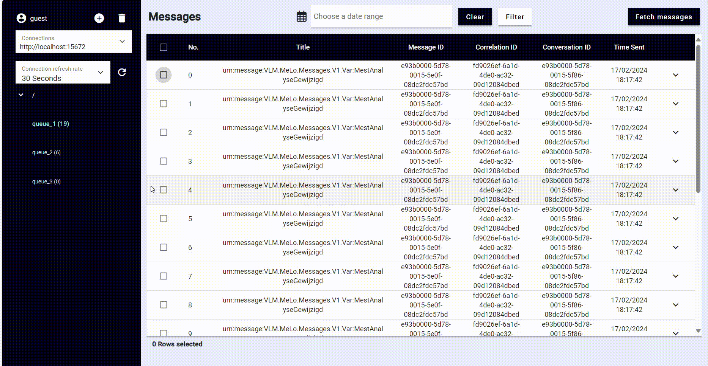

# QHopper

## Overview
QHopper is a modern desktop client built with [Angular](https://angular.dev/) and [Electron](https://www.electronjs.org/) for the [RabbitMQ](https://www.rabbitmq.com/) message broker. It allows users to view vhosts, queues, queue message counts, and message details. You can also move messages and filter them by date.

## Features
- Connect to RabbitMQ: Easily connect to your RabbitMQ server.
- View Vhosts: See a list of your virtual hosts.
- Manage Queues: Access and view your queues.
- Message Counts: View the number of messages in each queue.
- Message Details: Inspect details of individual messages.
- Move Messages: Move messages between queues.
- Filter by Date: Filter messages based on their date.
- Selecting Multiple Messages : Use shift-key to select multiple messages.  

## Setup
Prerequisites
- RabbitMQ Server
- NodeJS
#
1. Clone the repository:
```
git clone https://github.com/kubatemer/qhopper.git
```

2. Install dependencies:
```
npm install
```
3. Run application:
```
npm run build-electron
```
## Usage
### Connecting to RabbitMQ
Enter your RabbitMQ server details and click save


After you have made a successful connection, you should be able to see your vhosts and queues in the sidebar. Refresh rate will be set OFF as default. This is only for refreshing the sidebar, not the messages.


#

### Displaying message details
Clicking on the arrow will expand the panel displaying additional details.


#

### Moving messages
Check the boxes of the desired messages to be moved and drag them to the target queue.


#

### Filtering by date
Choose the date range in the input and click the filter button. Using the clear button will remove the filter and display all messages.


#

### Selecting Multiple Messages
You can select multiple messages by holding the shift key:

- If you check one checkbox, hold the shift key, and then select another checkbox, it will select everything in between.
- If you haven't selected any checkboxes, hold the shift key and select a checkbox, it will select everything from the beginning to that checkbox.


#

## How to Contribute

We welcome contributions from the community! Please follow these guidelines to help us maintain a high standard of quality and efficiency in the project.

### Getting Started

1.  **Fork the repository**: Start by forking the project repository to your own GitHub account.
2.  **Clone the repository**: Clone your forked repository to your local machine.
    
    ```
    git clone https://github.com/kubatemer/qhopper.git
    ```
    
4.  **Create a branch**: Always create a new branch before starting work on a new feature or bugfix.
    
    ```
    git checkout -b feature/feature-name
    ```

### Making Changes

1.  **Keep commits small**: Make small, incremental changes with clear and descriptive commit messages.
2.  **Follow coding standards**: Ensure your code follows the project's coding standards and style guidelines.
3.  **Add tests**: If you are adding new features or fixing bugs, include tests to cover your changes.

### Submitting Changes

1.  **Push to your branch**: Push your changes to the branch you created in your forked repository.
  
    ```
    git push origin feature/feature-name
    ```
    
3.  **Open a pull request**: Go to the original repository and open a pull request from your branch. Provide a clear description of your changes, referencing any relevant issues.
4.  **Get your pull request reviewed**: Assign the pull request to one of the project maintainers for review. Be prepared to make changes based on feedback.

### Code Review Process

1.  **Peer review**: Another contributor or maintainer will review your pull request. They will check for code quality, adherence to coding standards, and potential issues.
2.  **Approval**: Once your pull request has been reviewed and approved, a maintainer will merge it into the main branch.

### Best Practices

-   **Stay up-to-date**: Regularly pull updates from the main repository to avoid conflicts and stay current with the project's progress.
    
    ```
    git pull upstream main
    ```
    
-   **Respect coding standards**: Adhere to the project's coding conventions and guidelines.
-   **Be respectful**: Engage in respectful and constructive discussions. Our community values collaboration and inclusivity.

Thank you for your interest in contributing! We look forward to your participation in improving this project.
