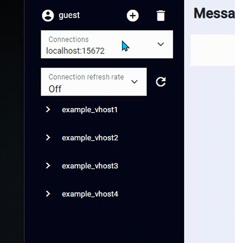

# QHopper

## Overview
QHopper is a modern desktop client built with [Angular](https://angular.dev/) and [Electron](https://www.electronjs.org/) for the [RabbitMQ](https://www.rabbitmq.com/) message broker. The application allows users to connect to their RabbitMQ instance(s) and retrieve data on available queues and their messages.

## Features
- Connect to RabbitMQ: Easily connect to your RabbitMQ server.
- View Vhosts: See a list of your virtual hosts.
- Manage Queues: Access and view your queues.
- Message Counts: View the number of messages in each queue.
- Message Details: Inspect details of individual messages.
- Move Messages: Move messages between queues.
- Filter by Date: Filter messages based on their date.
- Selecting Multiple Messages : Use shift-key to select multiple messages.  

## Setup
Prerequisites
- RabbitMQ Server
- NodeJS
#
1. Clone the repository:
```
git clone https://github.com/kubatemer/qhopper.git
```

2. Install dependencies:
```
npm install
```
3. Run application:
```
npm run build-electron
```
## Usage
### Connecting to RabbitMQ
Enter your RabbitMQ server details and click save. Writing the http or https is not required since it adds it automatically.


After you have made a successful connection, you should be able to see your vhosts and queues in the sidebar. Refresh rate will be set OFF as default. This is only for refreshing the sidebar, not the messages.


#

### Displaying message details
Clicking on the arrow will expand the panel displaying additional details.


#

### Moving messages
Check the boxes of the desired messages to be moved and drag them to the target queue.


#

### Filtering by date
Choose the date range in the input and click the filter button. Using the clear button will remove the filter and display all messages.


#

### Selecting Multiple Messages
You can select multiple messages by holding the shift key:

- If you check one checkbox, hold the shift key, and then select another checkbox, it will select everything in between.
- If you haven't selected any checkboxes, hold the shift key and select a checkbox, it will select everything from the beginning to that checkbox.


#

## How to Contribute

We are excited to have you contribute to this project! Whether it's reporting bugs, suggesting or features, your involvement is valuable. Before you start, please make sure to read through our [Contribution Docs](CONTRIBUTING.md) for detailed guidelines and best practices.
