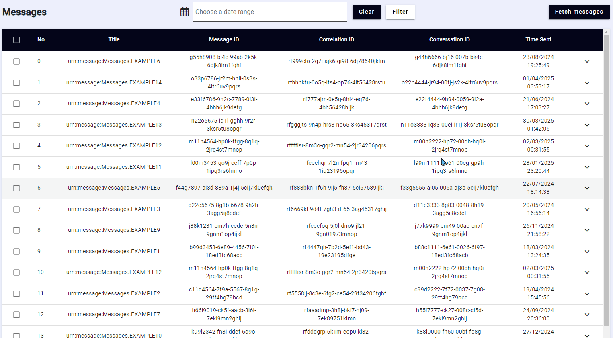

# QHopper

## Overview
QHopper is a desktop application built with Angular and Electron, designed to interact with RabbitMQ. It allows you to view vhosts, queues, queue message counts, and message details. You can also move messages and filter them by date.

## Features
- Connect to RabbitMQ: Easily connect to your RabbitMQ server.
- View Vhosts: See a list of your virtual hosts.
- Manage Queues: Access and view your queues.
- Message Counts: View the number of messages in each queue.
- Message Details: Inspect details of individual messages.
- Move Messages: Move messages between queues.
- Filter by Date: Filter messages based on their date.

## Setup
Prerequisites
- RabbitMQ Server
- NodeJS
#
1. Clone the repository:
```
git clone https://github.com/kubatemer/qhopper.git
```

2. Install dependencies:
```
npm install
```
3. Run application:
```
npm run build-electron
```
## Usage
### Connecting to RabbitMQ
Enter your RabbitMQ server details and click save


After you have made a successful connection, you should be able to see your vhosts and queues in the sidebar. Refresh rate will be set OFF as default. This is only for refreshing the sidebar, not the messages.


#

### Displaying message details
Clicking on the arrow will expand the panel displaying additional details.


#

### Moving messages
Check the boxes of the desired messages to be moved and drag them to the target queue.


#

### Filtering by date
Choose the date range in the input and click the filter button. Using the clear button will remove the filter and display all messages.


#

## How to contribute
